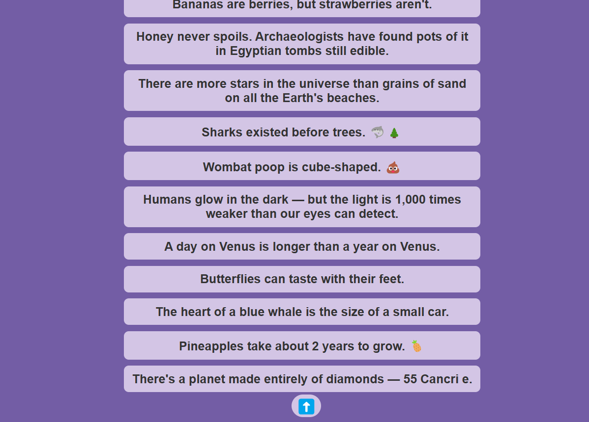

# ⬆️ Scroll-to-Top Button (React)

A simple and functional **scroll-to-top button** built using React. This button becomes visible when you scroll down and allows you to smoothly scroll back to the top of the page.

---

## 📌 Features
- ✅ **Visibility on Scroll**: The button becomes visible when the user scrolls down the page.
- ✅ **Smooth Scroll**: Click the button to smoothly scroll back to the top of the page.
- ✅ **Clean UI**: Styled with a sleek, modern design using an external CSS file.
- ✅ **Optimized Performance**: Uses `useState` and `useEffect` for efficient state management.

---

## 🛠️ Technologies Used
- ⚛️ **React** (`useState`, `useEffect`)
- 🎨 **CSS** (`Scroll.css` for styling and animations)
- 📄 **JSX** (Structured in `Scroll.js`)


---

## 🚀 Live Demo
To see it in action, clone the repository and follow the setup instructions below.

1. **Clone the repository:**

   ```bash
   git clone https://github.com/Eshhaa11/scroll-to-top-button
   
   
2. **Navigate to the project directory:**

   cd  multi-step-form

3. **Install dependencies:**

   npm install

4. **Start the development server:**

   npm start

5. **Open your browser and visit:**

   http://localhost:3000

---

 ## 🎨 Screenshots:
 
 

 ---

 ## 🤝 Contributing:
 Want to improve this project? Fork the repository, create a feature branch, and open a pull request. All contributions are welcome! 🚀✨
 
 ---

 🎉 Happy Coding!